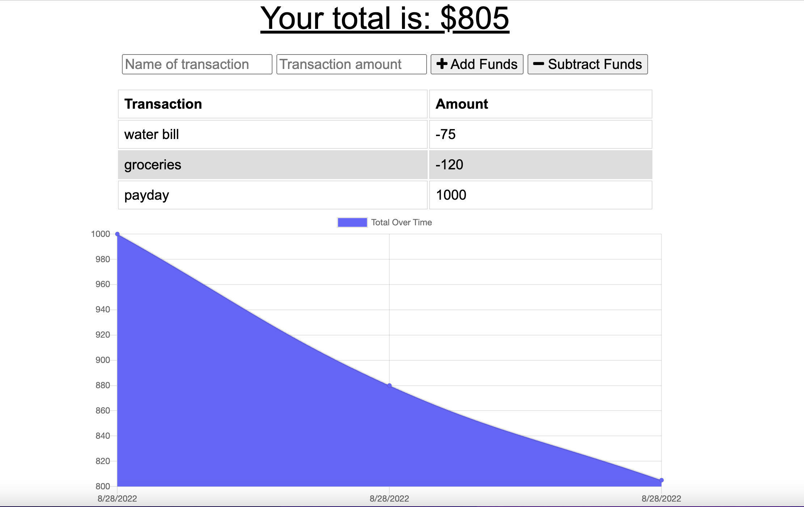

# Budget Tracker

## Description
This app is used to track a simple budget.  It allows the user to add and subtract funds which are then displayed graphically.  This is a PWA (progressive web application) that allows a user to download an icon to the device's homepage for quick access. The application also has offline functionallity so transactions will be saved and added once connection is reestablished.

* Made with node.js, express.js, and MongoDb.
* IndexedDb for offline functionallity.
* The PWA uses a manifest.json

## Deployed Application
The app is deployed with Heroku at https://ancient-retreat-46441.herokuapp.com/

## Installation
To access the application locally:

Install dependencies by running `npm i` in the command line.
MongoDB and node.js are also required.

Use `npm start` to view the page at localhost:3001 in the browser.

## Screenshot

 

## Contributions
Created by Chris Hodges from starter code provided by 2U Education/ UNC Bootcamp

## Questions
For any questions, contact me at chrisdhodges12@gmail.com or find me on GitHub at https://github.com/chrisdhodges12

